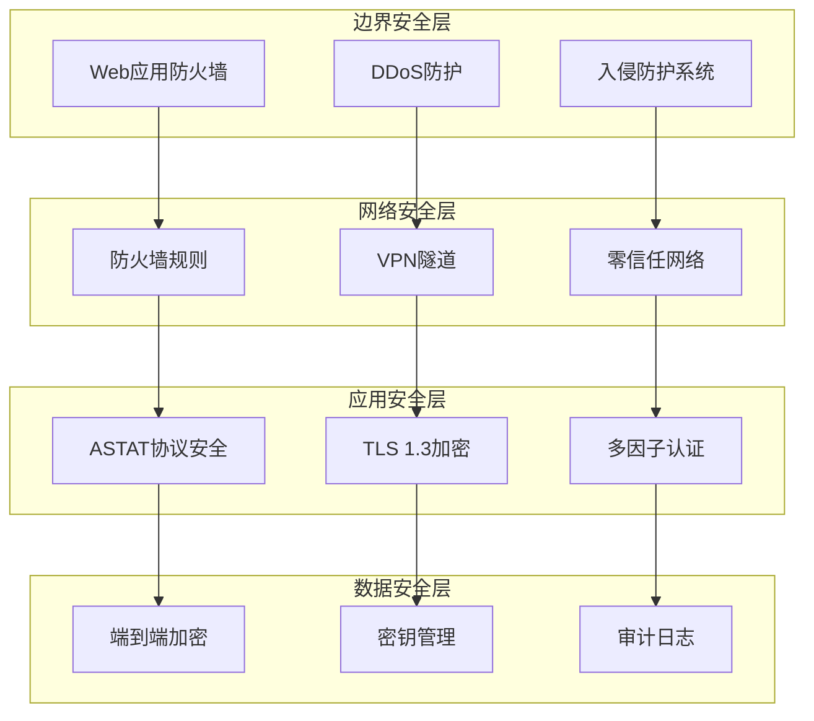
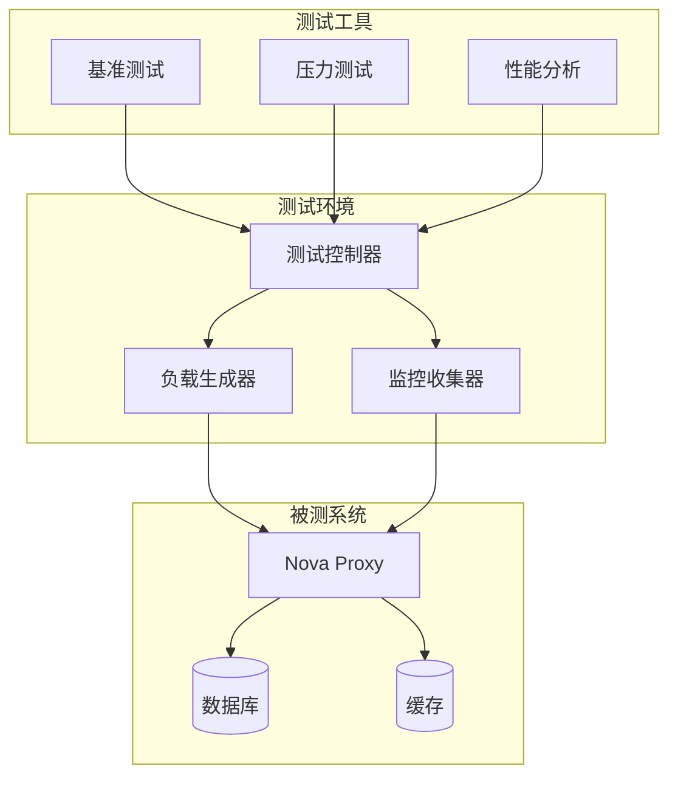
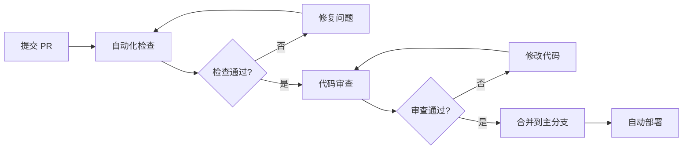

# Nova Proxy

[](https://github.com/Arthur-spec53/nova-proxy/actions)
[](https://goreportcard.com/report/github.com/Arthur-spec53/nova-proxy)
[](https://codecov.io/gh/Arthur-spec53/nova-proxy)
[](https://opensource.org/licenses/MIT)
[](https://hub.docker.com/r/arthur-spec53/nova-proxy)
[](https://golang.org/)
[](https://github.com/Arthur-spec53/nova-proxy/releases)

## 概述

**Nova Proxy** 是一个基于现代网络协议栈的高性能代理服务器，专为企业级应用和云原生环境设计。项目核心基于自研的 **ASTAT (Adaptive Shaping Transport with Authenticated Tunneling)** 协议，该协议在 QUIC 基础上实现了增强的加密传输层 (E-QUIC) 和智能流量塑形技术，提供了卓越的抗审查能力和网络性能优化。

### 技术架构特点

- **协议创新**: 基于 QUIC 的自适应传输协议，支持 0-RTT 连接建立
- **加密增强**: E-QUIC 二次加密层，提供协议指纹混淆和深度包检测 (DPI) 规避
- **智能塑形**: 统计学不可区分的流量模式，对抗网络流量分析
- **多路径传输**: MP-QUIC 实现，支持链路聚合和故障切换
- **云原生设计**: Kubernetes 原生支持，完整的可观测性和运维工具链

## 🏗️ 技术特性

### 🌐 ASTAT 协议栈

**ASTAT (Adaptive Shaping Transport with Authenticated Tunneling)** 是 Nova Proxy 的核心传输协议，在标准 QUIC 基础上实现了多层增强：

#### 传输层增强 (E-QUIC)
- **双重加密架构**: QUIC 内置 TLS 1.3 + 自定义加密层
- **协议指纹混淆**: 完全隐藏 QUIC 协议特征，规避 DPI 检测
- **动态密钥轮换**: 基于时间和流量的自适应密钥更新机制
- **完美前向保密**: 每个会话使用独立的临时密钥

#### 智能流量塑形
- **统计学不可区分性**: 通过填充和时序随机化实现流量模式混淆
- **自适应带宽管理**: 基于网络状况的动态速率控制
- **多维度伪装**: 包大小、时间间隔、突发模式的智能调节
- **机器学习对抗**: 针对流量分析算法的主动防护

#### 多路径传输 (MP-QUIC)
- **路径聚合**: 同时利用多个网络接口提升吞吐量
- **智能调度**: 基于延迟、丢包率的动态路径选择
- **故障切换**: 毫秒级路径故障检测和切换
- **负载均衡**: 跨路径的智能流量分配

### ⚡ 高性能架构

#### 网络 I/O 优化
- **零拷贝传输**: 基于 `io_uring` 和 `sendfile` 的高效数据传输
- **异步事件驱动**: Go 协程池 + epoll/kqueue 事件循环
- **内存池管理**: 预分配缓冲区，减少 GC 压力
- **NUMA 感知**: 针对多核架构的内存和 CPU 亲和性优化

#### 连接管理
- **连接复用**: HTTP/2 多路复用 + QUIC 流复用
- **连接池**: 智能连接预热和回收机制
- **Keep-Alive 优化**: 自适应超时和心跳机制
- **背压控制**: 基于队列深度的流量控制

#### 缓存系统
- **多级缓存**: L1 内存缓存 + L2 Redis 缓存 + L3 磁盘缓存
- **智能预取**: 基于访问模式的内容预加载
- **缓存一致性**: 分布式缓存失效和更新机制
- **压缩存储**: Zstd/LZ4 实时压缩，节省存储空间

### 🔒 企业级安全

#### 加密和认证
- **现代密码学**: ChaCha20-Poly1305, AES-256-GCM, X25519 ECDH
- **量子安全**: 支持后量子密码学算法 (Kyber, Dilithium)
- **多因子认证**: TOTP, FIDO2/WebAuthn, 证书认证
- **零信任架构**: 基于身份的访问控制和微分段

#### 威胁防护
- **DDoS 缓解**: 基于机器学习的异常流量检测
- **WAF 引擎**: OWASP Top 10 防护 + 自定义规则引擎
- **入侵检测**: 基于行为分析的实时威胁识别
- **蜜罐集成**: 主动威胁情报收集和分析

#### 合规性
- **数据保护**: GDPR, CCPA 合规的数据处理
- **审计日志**: 完整的访问和操作审计轨迹
- **加密存储**: 静态数据 AES-256 加密
- **密钥管理**: HSM 集成和密钥生命周期管理

### 📊 全栈可观测性

#### 指标监控
- **多维度指标**: 业务、应用、基础设施三层监控
- **实时聚合**: PromQL 查询引擎 + 时序数据库
- **自定义仪表板**: Grafana 模板 + 业务大屏
- **智能告警**: 基于机器学习的异常检测和预测

#### 分布式追踪
- **端到端追踪**: OpenTelemetry 标准实现
- **性能分析**: 请求链路分析和瓶颈识别
- **错误追踪**: 异常传播路径和根因分析
- **依赖映射**: 服务拓扑和依赖关系可视化

#### 日志管理
- **结构化日志**: JSON 格式 + 标准化字段
- **集中收集**: ELK/EFK 栈 + 日志聚合
- **实时分析**: 基于流处理的日志分析
- **长期存储**: 冷热数据分离 + 压缩归档

### ☁️ 云原生生态

#### Kubernetes 集成
- **原生资源**: CRD 定义 + Operator 模式
- **服务网格**: Istio/Linkerd 集成
- **自动扩缩容**: HPA/VPA + 自定义指标
- **滚动更新**: 蓝绿部署 + 金丝雀发布

#### 容器化
- **多阶段构建**: 最小化镜像 + 安全扫描
- **非 Root 运行**: 最小权限原则
- **资源限制**: CPU/内存/网络 QoS
- **健康检查**: 存活性和就绪性探针

## 🏗️ 系统架构

### 整体架构图

```
┌─────────────────────────────────────────────────────────────────────────────────┐
│                                 Nova Proxy 生态系统                                │
├─────────────────────────────────────────────────────────────────────────────────┤
│  ┌─────────────┐   ┌─────────────┐   ┌─────────────┐   ┌─────────────┐          │
│  │   Client    │   │   Client    │   │   Client    │   │   Client    │          │
│  │  (HTTP/1.1) │   │  (HTTP/2)   │   │ (HTTP/3)    │   │  (SOCKS5)   │          │
│  └─────────────┘   └─────────────┘   └─────────────┘   └─────────────┘          │
│         │                  │                  │                  │               │
│         └──────────────────┼──────────────────┼──────────────────┘               │
│                            │                  │                                  │
│  ┌─────────────────────────┼──────────────────┼─────────────────────────────┐    │
│  │                    Load Balancer / Ingress                              │    │
│  │                   (Traefik / Nginx / HAProxy)                           │    │
│  └─────────────────────────┼──────────────────┼─────────────────────────────┘    │
│                            │                  │                                  │
│  ┌─────────────────────────┼──────────────────┼─────────────────────────────┐    │
│  │                        Nova Proxy Core                                  │    │
│  │  ┌─────────────────┐   ┌─────────────────┐   ┌─────────────────┐        │    │
│  │  │   Connection    │   │     ASTAT       │   │    Protocol     │        │    │
│  │  │   Manager       │◄─►│    Router       │◄─►│    Handler      │        │    │
│  │  └─────────────────┘   └─────────────────┘   └─────────────────┘        │    │
│  │           │                      │                      │               │    │
│  │  ┌─────────────────┐   ┌─────────────────┐   ┌─────────────────┐        │    │
│  │  │    E-QUIC       │   │    Traffic      │   │   Security      │        │    │
│  │  │   Encryption    │   │    Shaping      │   │   Engine        │        │    │
│  │  └─────────────────┘   └─────────────────┘   └─────────────────┘        │    │
│  │           │                      │                      │               │    │
│  │  ┌─────────────────┐   ┌─────────────────┐   ┌─────────────────┐        │    │
│  │  │   MP-QUIC       │   │    Cache        │   │   Monitoring    │        │    │
│  │  │   Transport     │   │    Layer        │   │   & Metrics     │        │    │
│  │  └─────────────────┘   └─────────────────┘   └─────────────────┘        │    │
│  └─────────────────────────┼──────────────────┼─────────────────────────────┘    │
│                            │                  │                                  │
│  ┌─────────────────────────┼──────────────────┼─────────────────────────────┐    │
│  │                    Backend Services                                      │    │
│  │  ┌─────────────┐   ┌─────────────┐   ┌─────────────┐   ┌─────────────┐  │    │
│  │  │  Service A  │   │  Service B  │   │  Service C  │   │  Service N  │  │    │
│  │  │ (HTTP API)  │   │ (gRPC API)  │   │ (WebSocket) │   │ (Database)  │  │    │
│  │  └─────────────┘   └─────────────┘   └─────────────┘   └─────────────┘  │    │
│  └─────────────────────────────────────────────────────────────────────────┘    │
└─────────────────────────────────────────────────────────────────────────────────┘

┌─────────────────────────────────────────────────────────────────────────────────┐
│                              监控和运维生态系统                                    │
├─────────────────────────────────────────────────────────────────────────────────┤
│  ┌─────────────┐   ┌─────────────┐   ┌─────────────┐   ┌─────────────┐          │
│  │  Prometheus │   │   Grafana   │   │   Jaeger    │   │ AlertManager│          │
│  │  (Metrics)  │   │(Dashboard)  │   │ (Tracing)   │   │ (Alerting)  │          │
│  └─────────────┘   └─────────────┘   └─────────────┘   └─────────────┘          │
│         │                  │                  │                  │               │
│  ┌─────────────┐   ┌─────────────┐   ┌─────────────┐   ┌─────────────┐          │
│  │    ELK      │   │    Redis    │   │  PostgreSQL │   │   Consul    │          │
│  │  (Logging)  │   │  (Cache)    │   │ (Metadata)  │   │(Discovery)  │          │
│  └─────────────┘   └─────────────┘   └─────────────┘   └─────────────┘          │
└─────────────────────────────────────────────────────────────────────────────────┘
```

### 核心组件架构

#### 1. 连接管理层 (Connection Management Layer)
```
┌─────────────────────────────────────────────────────────────┐
│                    Connection Manager                       │
├─────────────────────────────────────────────────────────────┤
│  ┌─────────────┐  ┌─────────────┐  ┌─────────────┐         │
│  │ TCP Pool    │  │ QUIC Pool   │  │ HTTP Pool   │         │
│  │ Manager     │  │ Manager     │  │ Manager     │         │
│  └─────────────┘  └─────────────┘  └─────────────┘         │
│         │                 │                 │              │
│  ┌─────────────┐  ┌─────────────┐  ┌─────────────┐         │
│  │ Keep-Alive  │  │ Load        │  │ Health      │         │
│  │ Manager     │  │ Balancer    │  │ Checker     │         │
│  └─────────────┘  └─────────────┘  └─────────────┘         │
└─────────────────────────────────────────────────────────────┘
```

#### 2. ASTAT 协议栈 (ASTAT Protocol Stack)
```
┌─────────────────────────────────────────────────────────────┐
│                      Application Layer                      │
├─────────────────────────────────────────────────────────────┤
│                      ASTAT Router                          │
├─────────────────────────────────────────────────────────────┤
│                    Traffic Shaping Layer                   │
│  ┌─────────────┐  ┌─────────────┐  ┌─────────────┐         │
│  │ Padding     │  │ Timing      │  │ Pattern     │         │
│  │ Engine      │  │ Randomizer  │  │ Obfuscator  │         │
│  └─────────────┘  └─────────────┘  └─────────────┘         │
├─────────────────────────────────────────────────────────────┤
│                    E-QUIC Encryption Layer                 │
│  ┌─────────────┐  ┌─────────────┐  ┌─────────────┐         │
│  │ Key         │  │ Cipher      │  │ MAC         │         │
│  │ Manager     │  │ Engine      │  │ Validator   │         │
│  └─────────────┘  └─────────────┘  └─────────────┘         │
├─────────────────────────────────────────────────────────────┤
│                      QUIC Transport Layer                  │
│  ┌─────────────┐  ┌─────────────┐  ┌─────────────┐         │
│  │ Stream      │  │ Flow        │  │ Congestion  │         │
│  │ Manager     │  │ Control     │  │ Control     │         │
│  └─────────────┘  └─────────────┘  └─────────────┘         │
├─────────────────────────────────────────────────────────────┤
│                      UDP Transport Layer                   │
└─────────────────────────────────────────────────────────────┘
```

#### 3. 安全架构 (Security Architecture)
```
┌─────────────────────────────────────────────────────────────┐
│                      Security Gateway                       │
├─────────────────────────────────────────────────────────────┤
│  ┌─────────────┐  ┌─────────────┐  ┌─────────────┐         │
│  │    WAF      │  │   DDoS      │  │    IDS      │         │
│  │  Engine     │  │ Protection  │  │   Engine    │         │
│  └─────────────┘  └─────────────┘  └─────────────┘         │
├─────────────────────────────────────────────────────────────┤
│                    Authentication Layer                    │
│  ┌─────────────┐  ┌─────────────┐  ┌─────────────┐         │
│  │    JWT      │  │    mTLS     │  │   OAuth2    │         │
│  │ Validator   │  │ Validator   │  │ Provider    │         │
│  └─────────────┘  └─────────────┘  └─────────────┘         │
├─────────────────────────────────────────────────────────────┤
│                    Authorization Layer                     │
│  ┌─────────────┐  ┌─────────────┐  ┌─────────────┐         │
│  │    RBAC     │  │    ABAC     │  │   Policy    │         │
│  │   Engine    │  │   Engine    │  │   Engine    │         │
│  └─────────────┘  └─────────────┘  └─────────────┘         │
└─────────────────────────────────────────────────────────────┘
```

## 🚀 部署架构

### 部署模式概览

Nova Proxy 支持多种部署架构，从单机开发到大规模生产集群：

```
┌─────────────────────────────────────────────────────────────────────────────────┐
│                              部署架构矩阵                                        │
├─────────────────┬─────────────────┬─────────────────┬─────────────────────────┤
│   部署模式      │    资源需求     │    适用场景     │       核心组件          │
├─────────────────┼─────────────────┼─────────────────┼─────────────────────────┤
│ 开发环境        │ 2GB RAM         │ 本地开发测试    │ Nova Server + 基础监控  │
│ (Development)   │ 2 CPU Cores     │ 功能验证        │ Prometheus + Grafana    │
├─────────────────┼─────────────────┼─────────────────┼─────────────────────────┤
│ 轻量级部署      │ 1GB RAM         │ 资源受限环境    │ Nova Server Only        │
│ (Minimal)       │ 1 CPU Core      │ 边缘计算        │ 基础健康检查            │
├─────────────────┼─────────────────┼─────────────────┼─────────────────────────┤
│ 标准部署        │ 4GB RAM         │ 中小型生产      │ 完整监控栈              │
│ (Standard)      │ 4 CPU Cores     │ 企业内网        │ ELK + Redis + Jaeger    │
├─────────────────┼─────────────────┼─────────────────┼─────────────────────────┤
│ 生产环境        │ 8GB+ RAM        │ 大规模生产      │ 高可用集群              │
│ (Production)    │ 8+ CPU Cores    │ 公网服务        │ 负载均衡 + 自动扩缩容   │
├─────────────────┼─────────────────┼─────────────────┼─────────────────────────┤
│ 云原生集群      │ 动态扩缩容      │ 容器化环境      │ Kubernetes + Helm       │
│ (Cloud Native)  │ 按需分配        │ 微服务架构      │ Service Mesh + Operator │
└─────────────────┴─────────────────┴─────────────────┴─────────────────────────┘
```

### 🎯 智能管理工具

Nova Proxy 提供了企业级的命令行管理工具，支持自动化部署和运维：

```bash
# 启动智能管理工具
./scripts/nova-manager.sh
```

#### 🌟 管理工具核心功能

**系统评估与规划**
- **硬件资源评估**: CPU、内存、磁盘、网络带宽自动检测
- **环境兼容性检查**: Docker、Kubernetes、网络配置验证
- **部署方案推荐**: 基于资源和需求的智能推荐算法
- **容量规划**: 预估负载和资源需求，提供扩容建议

**自动化部署**
- **一键部署**: 零配置快速启动，适合快速验证
- **模板化配置**: 预定义的最佳实践配置模板
- **渐进式部署**: 蓝绿部署、金丝雀发布、滚动更新
- **回滚机制**: 自动备份和一键回滚功能

**运维管理**
- **服务编排**: 多服务依赖管理和启动顺序控制
- **健康监控**: 实时服务状态监控和异常告警
- **日志聚合**: 集中化日志收集、分析和查询
- **性能调优**: 自动性能分析和优化建议

**安全管理**
- **证书管理**: 自动证书生成、更新和轮换
- **密钥管理**: 安全的密钥生成、存储和分发
- **访问控制**: 基于角色的权限管理
- **安全扫描**: 容器镜像和配置安全检查

#### 管理工具菜单

```
╔══════════════════════════════════════════════════════════════╗
║                    Nova Proxy 管理工具                       ║
╠══════════════════════════════════════════════════════════════╣
║  1. 🔍 系统检查和环境评估                                    ║
║  2. 🚀 智能部署向导                                          ║
║  3. ⚙️  服务管理中心                                         ║
║  4. 📊 监控和告警配置                                        ║
║  5. 🔒 安全配置管理                                          ║
║  6. 📈 性能优化工具                                          ║
║  7. 🔧 故障诊断和修复                                        ║
║  8. 📋 配置模板管理                                          ║
║  9. 🌐 网络配置工具                                          ║
║ 10. 💾 备份和恢复                                            ║
║ 11. 📊 报告和分析                                            ║
║ 12. ❓ 帮助和文档                                            ║
╚══════════════════════════════════════════════════════════════╝
```

## 🚀 快速开始

### 环境准备

**系统要求**
```bash
# 最低配置
CPU: 1 Core (推荐 2+ Cores)
RAM: 1GB (推荐 4GB+)
Disk: 10GB 可用空间
OS: Linux/macOS/Windows (支持 Docker)

# 网络要求
端口: 8080 (Nova Server), 1080 (SOCKS5), 9090 (Prometheus)
带宽: 10Mbps+ (生产环境推荐 100Mbps+)
```

**依赖检查**
```bash
# 检查 Docker 环境
docker --version          # >= 20.10.0
docker-compose --version  # >= 1.29.0

# 检查系统资源
free -h                   # 内存使用情况
df -h                     # 磁盘空间
ss -tuln | grep -E '(8080|1080|9090)'  # 端口占用检查
```

### 部署方式选择

#### 方式一：智能管理工具 (推荐)

**适用场景**: 生产环境、企业部署、需要专业运维支持

```bash
# 克隆项目
git clone https://github.com/Arthur-spec53/nova-proxy.git
cd nova-proxy

# 启动智能管理工具
./scripts/nova-manager.sh

# 系统会自动:
# 1. 检测硬件资源和网络环境
# 2. 推荐最适合的部署方案
# 3. 自动生成优化配置
# 4. 执行部署并验证服务状态
```

**管理工具优势**:
- 🔍 **智能评估**: 自动检测系统资源，推荐最优部署方案
- 🚀 **一键部署**: 零配置启动，自动处理依赖和配置
- 📊 **实时监控**: 部署过程可视化，实时状态反馈
- 🔧 **故障自愈**: 自动检测和修复常见部署问题
- 📋 **最佳实践**: 内置企业级配置模板和安全策略

#### 方式二：Docker Compose 部署

**适用场景**: 开发测试、快速验证、容器化环境

```bash
# 克隆项目
git clone https://github.com/Arthur-spec53/nova-proxy.git
cd nova-proxy

# 选择部署模式

# 1. 轻量级部署 (最小资源)
docker compose -f docker-compose.minimal.yml up -d

# 2. 开发环境部署 (包含基础监控)
docker compose -f docker-compose.dev.yml up -d

# 3. 标准部署 (完整监控栈)
docker compose up -d

# 4. 生产环境部署 (高可用配置)
docker compose -f docker-compose.prod.yml up -d
```

**部署验证**
```bash
# 检查服务状态
docker compose ps

# 查看服务日志
docker compose logs -f nova-server

# 健康检查
curl -f http://localhost:8080/health || echo "Service not ready"

# 性能测试
curl -w "@curl-format.txt" -o /dev/null -s http://localhost:8080/metrics
```

### 前置要求

- Docker 20.10+ 和 Docker Compose
- 至少 2GB 可用内存
- 至少 10GB 可用磁盘空间

### 本地开发

```bash
# 克隆项目
git clone https://github.com/Arthur-spec53/nova-proxy.git
cd nova-proxy

# 使用开发环境配置
cp .env.example .env

# 启动开发环境
docker compose -f docker-compose.dev.yml up -d

# 查看日志
docker compose -f docker-compose.dev.yml logs -f
```

### 生产部署

```bash
# 配置生产环境变量
cp .env.example .env
# 编辑 .env 文件，设置域名和密码

# 创建外部网络
docker network create traefik-public

# 启动生产环境
docker compose -f docker-compose.prod.yml up -d
```

### Kubernetes 部署

```bash
# 使用 Helm 部署
helm install nova-proxy ./helm/nova-proxy \
  --namespace nova-proxy \
  --create-namespace

# 或使用 Kubernetes 清单
kubectl apply -f deployments/k8s/
```

## ⚙️ 配置管理

### 配置架构概览

Nova Proxy 采用分层配置架构，支持多种配置来源和动态更新：

```
┌─────────────────────────────────────────────────────────────────────────────────┐
│                              配置管理架构                                        │
├─────────────────┬─────────────────┬─────────────────┬─────────────────────────┤
│   配置层级      │    配置来源     │    优先级       │       适用场景          │
├─────────────────┼─────────────────┼─────────────────┼─────────────────────────┤
│ 命令行参数      │ CLI Flags       │ 最高 (1)       │ 临时覆盖、调试测试      │
│ (CLI Args)      │ --port, --log   │                 │ 快速配置变更            │
├─────────────────┼─────────────────┼─────────────────┼─────────────────────────┤
│ 环境变量        │ Environment     │ 高 (2)         │ 容器化部署、CI/CD       │
│ (Env Vars)      │ NOVA_*          │                 │ 敏感信息配置            │
├─────────────────┼─────────────────┼─────────────────┼─────────────────────────┤
│ 配置文件        │ JSON/YAML       │ 中 (3)         │ 复杂配置、模板化        │
│ (Config Files)  │ server.json     │                 │ 版本控制管理            │
├─────────────────┼─────────────────┼─────────────────┼─────────────────────────┤
│ 默认配置        │ Built-in        │ 最低 (4)       │ 开箱即用、兜底配置      │
│ (Defaults)      │ Hardcoded       │                 │ 快速启动验证            │
└─────────────────┴─────────────────┴─────────────────┴─────────────────────────┘
```

### 核心配置参数

#### 🌐 网络配置

| 参数名 | 环境变量 | 默认值 | 说明 | 生产建议 |
|--------|----------|--------|------|----------|
| `server_addr` | `NOVA_SERVER_ADDR` | `:8080` | 服务器监听地址 | `:8080` 或指定 IP |
| `client_addr` | `NOVA_CLIENT_ADDR` | `:1080` | 客户端监听地址 | `:1080` |
| `max_connections` | `NOVA_MAX_CONNECTIONS` | `1000` | 最大并发连接数 | `5000-10000` |
| `buffer_size` | `NOVA_BUFFER_SIZE` | `32768` | 网络缓冲区大小 | `65536` |
| `timeout` | `NOVA_TIMEOUT` | `30s` | 连接超时时间 | `60s` |
| `keepalive` | `NOVA_KEEPALIVE` | `true` | TCP Keep-Alive | `true` |

#### 🔒 安全配置

| 参数名 | 环境变量 | 默认值 | 说明 | 安全建议 |
|--------|----------|--------|------|----------|
| `password` | `NOVA_PASSWORD` | `changeme` | 连接认证密码 | 32+ 字符强密码 |
| `preshared_key` | `NOVA_PRESHARED_KEY` | `auto-generated` | PSK 预共享密钥 | 256-bit 随机密钥 |
| `tls_cert_file` | `NOVA_TLS_CERT` | `""` | TLS 证书文件路径 | 有效 X.509 证书 |
| `tls_key_file` | `NOVA_TLS_KEY` | `""` | TLS 私钥文件路径 | 受保护的私钥 |
| `enable_tls` | `NOVA_ENABLE_TLS` | `false` | 启用 TLS 加密 | `true` (生产环境) |
| `cipher_suites` | `NOVA_CIPHER_SUITES` | `auto` | 加密套件选择 | `ECDHE-ECDSA-AES256-GCM-SHA384` |

#### 📊 监控配置

| 参数名 | 环境变量 | 默认值 | 说明 | 监控建议 |
|--------|----------|--------|------|----------|
| `enable_metrics` | `NOVA_ENABLE_METRICS` | `true` | 启用 Prometheus 指标 | `true` |
| `metrics_addr` | `NOVA_METRICS_ADDR` | `:9090` | 指标服务监听地址 | `:9090` |
| `enable_tracing` | `NOVA_ENABLE_TRACING` | `true` | 启用分布式追踪 | `true` |
| `jaeger_endpoint` | `NOVA_JAEGER_ENDPOINT` | `http://jaeger:14268/api/traces` | Jaeger 追踪端点 | 集群内地址 |
| `log_level` | `NOVA_LOG_LEVEL` | `info` | 日志级别 | `warn` (生产) |
| `log_format` | `NOVA_LOG_FORMAT` | `json` | 日志格式 | `json` |

#### ⚡ 性能配置

| 参数名 | 环境变量 | 默认值 | 说明 | 性能建议 |
|--------|----------|--------|------|----------|
| `worker_threads` | `NOVA_WORKER_THREADS` | `auto` | 工作线程数 | CPU 核心数 × 2 |
| `io_threads` | `NOVA_IO_THREADS` | `auto` | I/O 线程数 | CPU 核心数 |
| `enable_zero_copy` | `NOVA_ZERO_COPY` | `true` | 启用零拷贝优化 | `true` |
| `enable_splice` | `NOVA_ENABLE_SPLICE` | `true` | 启用 splice 系统调用 | `true` (Linux) |
| `tcp_nodelay` | `NOVA_TCP_NODELAY` | `true` | 禁用 Nagle 算法 | `true` |
| `tcp_fastopen` | `NOVA_TCP_FASTOPEN` | `true` | 启用 TCP Fast Open | `true` |

### 环境变量配置 (.env)

```bash
# ==================== 基础配置 ====================
BUILD_VERSION=latest
LOG_LEVEL=info
ENVIRONMENT=production

# ==================== Nova Proxy 核心配置 ====================
# 网络配置
NOVA_SERVER_ADDR=:8080
NOVA_CLIENT_ADDR=:1080
NOVA_MAX_CONNECTIONS=5000
NOVA_BUFFER_SIZE=65536
NOVA_TIMEOUT=60s
NOVA_KEEPALIVE=true

# 安全配置 (生产环境必须修改)
NOVA_PASSWORD=your-ultra-secure-password-32chars
NOVA_PRESHARED_KEY=your-256-bit-preshared-key-here
NOVA_ENABLE_TLS=true
NOVA_TLS_CERT=/etc/nova/certs/server.crt
NOVA_TLS_KEY=/etc/nova/certs/server.key

# ASTAT 协议配置
NOVA_ENABLE_EQUIC=true
NOVA_CONGESTION_CONTROL=bbr
NOVA_ENABLE_MULTIPATH=true
NOVA_PATH_SELECTION=rtt_based

# 流量塑形配置
NOVA_ENABLE_SHAPING=true
NOVA_SHAPING_PROFILE=adaptive
NOVA_MAX_BANDWIDTH=1Gbps
NOVA_BURST_SIZE=10MB

# 性能优化配置
NOVA_WORKER_THREADS=0  # 0 = auto (CPU cores * 2)
NOVA_IO_THREADS=0      # 0 = auto (CPU cores)
NOVA_ZERO_COPY=true
NOVA_ENABLE_SPLICE=true
NOVA_TCP_NODELAY=true
NOVA_TCP_FASTOPEN=true

# ==================== 监控配置 ====================
# Prometheus 指标
NOVA_ENABLE_METRICS=true
NOVA_METRICS_ADDR=:9090
NOVA_METRICS_PATH=/metrics

# 分布式追踪
NOVA_ENABLE_TRACING=true
NOVA_JAEGER_ENDPOINT=http://jaeger:14268/api/traces
NOVA_TRACE_SAMPLE_RATE=0.1

# 日志配置
NOVA_LOG_LEVEL=warn
NOVA_LOG_FORMAT=json
NOVA_LOG_OUTPUT=stdout
NOVA_ENABLE_ACCESS_LOG=true

# ==================== 域名配置 (生产环境) ====================
NOVA_DOMAIN=nova.example.com
PROMETHEUS_DOMAIN=prometheus.example.com
GRAFANA_DOMAIN=grafana.example.com
JAEGER_DOMAIN=jaeger.example.com
ALERTMANAGER_DOMAIN=alertmanager.example.com

# ==================== 认证配置 ====================
GRAFANA_ADMIN_PASSWORD=your-grafana-admin-password
REDIS_PASSWORD=your-redis-password
ELASTICSEARCH_PASSWORD=your-elasticsearch-password
HTTP_BASIC_AUTH_USER=admin
HTTP_BASIC_AUTH_PASSWORD=your-basic-auth-password

# ==================== 镜像配置 ====================
REGISTRY=your-registry.com/
VERSION=latest

# ==================== 高可用配置 ====================
# 集群配置
NOVA_CLUSTER_MODE=true
NOVA_CLUSTER_NODES=node1:8080,node2:8080,node3:8080
NOVA_CLUSTER_ELECTION_TIMEOUT=5s
NOVA_CLUSTER_HEARTBEAT_INTERVAL=1s

# 负载均衡
NOVA_LB_ALGORITHM=round_robin  # round_robin, least_conn, ip_hash
NOVA_LB_HEALTH_CHECK_INTERVAL=10s
NOVA_LB_HEALTH_CHECK_TIMEOUT=5s

# 自动扩缩容
NOVA_AUTO_SCALING=true
NOVA_MIN_REPLICAS=2
NOVA_MAX_REPLICAS=10
NOVA_CPU_TARGET_UTILIZATION=70
NOVA_MEMORY_TARGET_UTILIZATION=80
```

### Docker Compose 配置文件

项目提供了多种部署配置，适应不同的使用场景：

| 配置文件 | 适用场景 | 资源需求 | 包含组件 |
|----------|----------|----------|----------|
| `docker-compose.minimal.yml` | 资源受限环境、边缘计算 | 1GB RAM, 1 CPU | Nova Server + 基础健康检查 |
| `docker-compose.dev.yml` | 本地开发、功能测试 | 2GB RAM, 2 CPU | Nova Server + Prometheus + Grafana |
| `docker-compose.yml` | 标准生产环境 | 4GB RAM, 4 CPU | 完整监控栈 + ELK + Redis + Jaeger |
| `docker-compose.prod.yml` | 企业级生产环境 | 8GB+ RAM, 8+ CPU | 高可用集群 + 负载均衡 + 自动扩缩容 |

### 配置文件模板

#### 服务器配置 (server.json)

```json
{
  "network": {
    "listen_addr": ":8080",
    "max_connections": 5000,
    "buffer_size": 65536,
    "timeout": "60s",
    "keepalive": true,
    "tcp_nodelay": true,
    "tcp_fastopen": true
  },
  "security": {
    "password": "${NOVA_PASSWORD}",
    "preshared_key": "${NOVA_PRESHARED_KEY}",
    "enable_tls": true,
    "tls_cert_file": "/etc/nova/certs/server.crt",
    "tls_key_file": "/etc/nova/certs/server.key",
    "cipher_suites": [
      "TLS_ECDHE_ECDSA_WITH_AES_256_GCM_SHA384",
      "TLS_ECDHE_RSA_WITH_AES_256_GCM_SHA384"
    ]
  },
  "astat": {
    "enable_equic": true,
    "congestion_control": "bbr",
    "initial_window_size": 1048576,
    "max_window_size": 16777216,
    "enable_multipath": true,
    "path_selection": "rtt_based"
  },
  "shaping": {
    "enable": true,
    "profile": "adaptive",
    "max_bandwidth": "1Gbps",
    "burst_size": "10MB",
    "priority_queues": 8
  },
  "monitoring": {
    "enable_metrics": true,
    "metrics_addr": ":9090",
    "enable_tracing": true,
    "jaeger_endpoint": "http://jaeger:14268/api/traces",
    "sample_rate": 0.1
  },
  "logging": {
    "level": "info",
    "format": "json",
    "output": "stdout",
    "enable_access_log": true,
    "access_log_format": "combined"
  },
  "performance": {
    "worker_threads": 0,
    "io_threads": 0,
    "enable_zero_copy": true,
    "enable_splice": true,
    "memory_pool_size": "256MB",
    "gc_target_percentage": 75
  }
}
```

#### 客户端配置 (client.json)

```json
{
  "remote_addr": "server.example.com:8080",
  "listen_addr": ":1080",
  "password": "${NOVA_PASSWORD}",
  "preshared_key": "${NOVA_PRESHARED_KEY}",
  "shaping_profile": "gaming",
  "log_level": "info",
  "tls": {
    "enable": true,
    "verify_cert": true,
    "ca_file": "/etc/nova/certs/ca.crt",
    "server_name": "server.example.com"
  },
  "proxy": {
    "type": "socks5",
    "auth_required": false,
    "username": "",
    "password": ""
  },
  "advanced": {
    "connection_pool_size": 10,
    "retry_attempts": 3,
    "retry_delay": "1s",
    "health_check_interval": "30s"
  }
}
```
| `GRAFANA_ADMIN_PASSWORD` | Grafana 管理员密码 | `admin123` |
| `PROMETHEUS_DOMAIN` | Prometheus 域名 | `localhost` |
| `GRAFANA_DOMAIN` | Grafana 域名 | `localhost` |

## 🔧 开发指南

### 项目架构

Nova Proxy 采用模块化设计，遵循 Go 语言最佳实践和企业级开发标准：

```
nova-proxy/
├── cmd/                           # 应用程序入口点
│   ├── nova-server/              # 服务端主程序
│   │   ├── main.go               # 服务端启动入口
│   │   └── config.json           # 服务端配置模板
│   └── nova-client/              # 客户端主程序
│       ├── main.go               # 客户端启动入口
│       └── config.json           # 客户端配置模板
├── internal/                      # 内部核心模块 (不对外暴露)
│   ├── config/                   # 配置管理系统
│   │   ├── config.go             # 配置结构定义
│   │   ├── loader.go             # 配置加载器
│   │   └── validator.go          # 配置验证器
│   ├── server/                   # 服务端核心实现
│   │   ├── server.go             # 主服务器逻辑
│   │   ├── handler.go            # 请求处理器
│   │   └── middleware.go         # 中间件系统
│   ├── client/                   # 客户端核心实现
│   │   ├── client.go             # 主客户端逻辑
│   │   ├── proxy.go              # 代理处理器
│   │   └── pool.go               # 连接池管理
│   ├── protocol/                 # ASTAT 协议栈实现
│   │   ├── astat.go              # ASTAT 协议核心
│   │   ├── equic/                # E-QUIC 传输层
│   │   │   ├── connection.go     # QUIC 连接管理
│   │   │   ├── stream.go         # 流管理
│   │   │   └── crypto.go         # 加密实现
│   │   ├── multipath/            # 多路径传输
│   │   │   ├── scheduler.go      # 路径调度器
│   │   │   ├── detector.go       # 路径检测器
│   │   │   └── balancer.go       # 负载均衡器
│   │   └── congestion/           # 拥塞控制
│   │       ├── bbr.go            # BBR 算法实现
│   │       ├── cubic.go          # CUBIC 算法实现
│   │       └── adaptive.go       # 自适应算法
│   ├── shaping/                  # 智能流量塑形
│   │   ├── shaper.go             # 流量塑形器
│   │   ├── profiles/             # 塑形配置文件
│   │   │   ├── gaming.go         # 游戏优化配置
│   │   │   ├── streaming.go      # 流媒体优化配置
│   │   │   └── adaptive.go       # 自适应配置
│   │   ├── qos.go                # QoS 管理
│   │   └── classifier.go         # 流量分类器
│   ├── security/                 # 安全模块
│   │   ├── auth.go               # 认证系统
│   │   ├── crypto.go             # 加密工具
│   │   ├── tls.go                # TLS 配置
│   │   └── firewall.go           # 防火墙规则
│   ├── monitoring/               # 可观测性模块
│   │   ├── metrics/              # 指标收集
│   │   │   ├── prometheus.go     # Prometheus 集成
│   │   │   ├── collector.go      # 自定义收集器
│   │   │   └── registry.go       # 指标注册表
│   │   ├── tracing/              # 分布式追踪
│   │   │   ├── jaeger.go         # Jaeger 集成
│   │   │   ├── span.go           # Span 管理
│   │   │   └── context.go        # 追踪上下文
│   │   └── logging/              # 日志系统
│   │       ├── logger.go         # 结构化日志
│   │       ├── formatter.go      # 日志格式化
│   │       └── rotation.go       # 日志轮转
│   ├── storage/                  # 存储抽象层
│   │   ├── cache/                # 缓存系统
│   │   │   ├── redis.go          # Redis 实现
│   │   │   ├── memory.go         # 内存缓存
│   │   │   └── interface.go      # 缓存接口
│   │   └── persistence/          # 持久化存储
│   │       ├── database.go       # 数据库抽象
│   │       └── migration.go      # 数据迁移
│   └── utils/                    # 工具函数
│       ├── network.go            # 网络工具
│       ├── crypto.go             # 加密工具
│       ├── time.go               # 时间工具
│       └── validation.go         # 验证工具
├── pkg/                          # 公共包 (可对外暴露)
│   ├── api/                      # API 客户端
│   │   ├── client.go             # HTTP 客户端
│   │   └── types.go              # API 类型定义
│   ├── errors/                   # 错误处理
│   │   ├── codes.go              # 错误码定义
│   │   └── handler.go            # 错误处理器
│   └── version/                  # 版本信息
│       └── version.go            # 版本管理
├── api/                          # API 定义和文档
│   ├── openapi/                  # OpenAPI 规范
│   │   └── spec.yaml             # API 规范文件
│   ├── proto/                    # Protocol Buffers
│   │   └── nova.proto            # gRPC 服务定义
│   └── rest/                     # REST API 定义
│       └── handlers.go           # REST 处理器
├── configs/                      # 配置文件和模板
│   ├── server/                   # 服务端配置
│   │   ├── development.json      # 开发环境配置
│   │   ├── production.json       # 生产环境配置
│   │   └── testing.json          # 测试环境配置
│   ├── client/                   # 客户端配置
│   │   ├── default.json          # 默认客户端配置
│   │   └── profiles/             # 预设配置文件
│   │       ├── gaming.json       # 游戏优化配置
│   │       └── streaming.json    # 流媒体优化配置
│   └── monitoring/               # 监控配置
│       ├── prometheus.yml        # Prometheus 配置
│       ├── grafana/              # Grafana 仪表板
│       └── jaeger.yml            # Jaeger 配置
├── scripts/                      # 自动化脚本
│   ├── nova-manager.sh           # 智能管理工具
│   ├── system-check.sh           # 系统检查脚本
│   ├── deploy/                   # 部署脚本
│   │   ├── docker.sh             # Docker 部署
│   │   ├── k8s.sh                # Kubernetes 部署
│   │   └── production.sh         # 生产环境部署
│   ├── monitoring/               # 监控脚本
│   │   ├── setup.sh              # 监控设置
│   │   └── backup.sh             # 数据备份
│   └── development/              # 开发工具
│       ├── setup.sh              # 开发环境设置
│       └── test.sh               # 测试脚本
├── deployments/                  # 部署配置
│   ├── docker/                   # Docker 配置
│   │   ├── docker-compose.yml    # 标准部署
│   │   ├── docker-compose.dev.yml # 开发环境
│   │   ├── docker-compose.prod.yml # 生产环境
│   │   └── docker-compose.minimal.yml # 轻量级部署
│   ├── k8s/                      # Kubernetes 清单
│   │   ├── namespace.yaml        # 命名空间
│   │   ├── configmap.yaml        # 配置映射
│   │   ├── secret.yaml           # 密钥管理
│   │   ├── deployment.yaml       # 部署配置
│   │   ├── service.yaml          # 服务配置
│   │   ├── ingress.yaml          # 入口配置
│   │   └── monitoring/           # 监控组件
│   └── helm/                     # Helm Chart
│       ├── Chart.yaml            # Chart 元数据
│       ├── values.yaml           # 默认值
│       ├── values-prod.yaml      # 生产环境值
│       └── templates/            # 模板文件
├── tests/                        # 测试套件
│   ├── unit/                     # 单元测试
│   ├── integration/              # 集成测试
│   ├── e2e/                      # 端到端测试
│   ├── performance/              # 性能测试
│   └── fixtures/                 # 测试数据
├── docs/                         # 项目文档
│   ├── architecture/             # 架构文档
│   ├── api/                      # API 文档
│   ├── deployment/               # 部署文档
│   ├── development/              # 开发文档
│   └── troubleshooting/          # 故障排除
├── .github/                      # GitHub 配置
│   ├── workflows/                # CI/CD 工作流
│   │   ├── ci.yml                # 持续集成
│   │   ├── cd.yml                # 持续部署
│   │   ├── security.yml          # 安全扫描
│   │   └── release.yml           # 发布流程
│   ├── ISSUE_TEMPLATE/           # Issue 模板
│   └── PULL_REQUEST_TEMPLATE.md  # PR 模板
├── build/                        # 构建配置
│   ├── Dockerfile                # 主 Dockerfile
│   ├── Dockerfile.dev            # 开发环境 Dockerfile
│   ├── Dockerfile.minimal        # 最小化镜像
│   └── ci/                       # CI 构建脚本
├── vendor/                       # 依赖包 (可选)
├── go.mod                        # Go 模块定义
├── go.sum                        # 依赖校验和
├── Makefile                      # 构建和管理命令
├── .env.example                  # 环境变量示例
├── .gitignore                    # Git 忽略文件
├── LICENSE                       # 开源许可证
├── README.md                     # 项目说明文档
├── CHANGELOG.md                  # 变更日志
├── CONTRIBUTING.md               # 贡献指南
└── SECURITY.md                   # 安全政策
```

### 开发环境设置

#### 环境要求

```bash
# Go 语言环境
Go 1.21+ (推荐 1.22+)
GCC/Clang (CGO 支持)
Make (构建工具)

# 开发工具
Git 2.30+
Docker 20.10+
Docker Compose 2.0+
Kubectl (可选，用于 K8s 开发)
Helm 3.0+ (可选，用于 Helm Chart 开发)

# IDE 推荐
VS Code + Go 扩展
GoLand (JetBrains)
Vim/Neovim + vim-go
```

#### 快速开始

```bash
# 1. 克隆项目
git clone https://github.com/your-org/nova-proxy.git
cd nova-proxy

# 2. 安装依赖
go mod download
go mod verify

# 3. 设置开发环境
cp .env.example .env
./scripts/development/setup.sh

# 4. 运行开发环境
make dev

# 5. 运行测试
make test
```

### 代码规范和质量

#### 代码风格

```bash
# 代码格式化 (使用 gofmt)
go fmt ./...

# 代码整理 (使用 goimports)
goimports -w .

# 代码检查 (使用 go vet)
go vet ./...

# 静态分析 (使用 staticcheck)
staticcheck ./...

# 代码复杂度检查 (使用 gocyclo)
gocyclo -over 15 .

# 运行所有代码质量检查
make lint
```

#### 安全扫描

```bash
# 安全漏洞扫描 (使用 gosec)
gosec ./...

# 依赖漏洞扫描 (使用 govulncheck)
govulncheck ./...

# 许可证检查
make license-check

# 运行所有安全检查
make security
```

#### 代码覆盖率

```bash
# 生成覆盖率报告
go test -coverprofile=coverage.out ./...

# 查看覆盖率详情
go tool cover -html=coverage.out

# 覆盖率统计
go tool cover -func=coverage.out

# 设置覆盖率目标 (80%+)
make coverage
```

### 测试策略

#### 测试金字塔

```
        ┌─────────────────┐
        │   E2E Tests     │  <- 少量，高价值
        │   (5-10%)       │
        ├─────────────────┤
        │ Integration     │  <- 适量，关键路径
        │ Tests (20-30%)  │
        ├─────────────────┤
        │  Unit Tests     │  <- 大量，快速反馈
        │  (60-70%)       │
        └─────────────────┘
```

#### 测试命令

```bash
# 单元测试 (快速，隔离)
go test ./... -short

# 集成测试 (中等速度，真实依赖)
go test ./... -tags=integration

# 端到端测试 (慢速，完整流程)
go test ./... -tags=e2e

# 性能基准测试
go test -bench=. -benchmem ./...

# 压力测试
go test -race ./...

# 模糊测试 (Go 1.18+)
go test -fuzz=FuzzASTATProtocol ./internal/protocol

# 运行所有测试
make test-all
```

#### 测试最佳实践

```go
// 1. 测试命名规范
func TestServerStart_ValidConfig_Success(t *testing.T) {
    // Given (准备)
    config := &Config{Port: 8080}
    server := NewServer(config)
    
    // When (执行)
    err := server.Start()
    
    // Then (验证)
    assert.NoError(t, err)
    assert.True(t, server.IsRunning())
}

// 2. 表驱动测试
func TestPasswordValidation(t *testing.T) {
    tests := []struct {
        name     string
        password string
        want     bool
    }{
        {"valid strong password", "StrongP@ssw0rd123!", true},
        {"too short", "weak", false},
        {"no special chars", "WeakPassword123", false},
    }
    
    for _, tt := range tests {
        t.Run(tt.name, func(t *testing.T) {
            got := ValidatePassword(tt.password)
            assert.Equal(t, tt.want, got)
        })
    }
}

// 3. Mock 和依赖注入
func TestClientConnect_NetworkError_Retry(t *testing.T) {
    mockConn := &MockConnection{}
    mockConn.On("Connect").Return(errors.New("network error")).Once()
    mockConn.On("Connect").Return(nil).Once()
    
    client := NewClient(WithConnection(mockConn))
    err := client.Connect()
    
    assert.NoError(t, err)
    mockConn.AssertExpectations(t)
}
```

## 📊 监控和运维

### 可观测性架构

Nova Proxy 实现了完整的三支柱可观测性（Metrics、Logs、Traces），为生产环境提供全方位的监控和故障排除能力：

```
┌─────────────────────────────────────────────────────────────┐
│                    可观测性数据流                              │
├─────────────────────────────────────────────────────────────┤
│  Nova Proxy                                                 │
│  ┌─────────────┐  ┌─────────────┐  ┌─────────────┐          │
│  │   Metrics   │  │    Logs     │  │   Traces    │          │
│  │ (Prometheus)│  │ (Structured)│  │  (Jaeger)   │          │
│  └─────────────┘  └─────────────┘  └─────────────┘          │
│         │                │                │                 │
│         ▼                ▼                ▼                 │
│  ┌─────────────┐  ┌─────────────┐  ┌─────────────┐          │
│  │ Prometheus  │  │    Loki     │  │   Jaeger    │          │
│  │   Server    │  │   Server    │  │   Server    │          │
│  └─────────────┘  └─────────────┘  └─────────────┘          │
│         │                │                │                 │
│         └────────────────┼────────────────┘                 │
│                          ▼                                  │
│                 ┌─────────────┐                             │
│                 │   Grafana   │                             │
│                 │  Dashboard  │                             │
│                 └─────────────┘                             │
└─────────────────────────────────────────────────────────────┘
```

### 服务访问地址

#### 智能管理工具

```bash
# 使用管理工具获取所有服务访问地址
./scripts/nova-manager.sh
# 选择选项 13: 监控面板访问地址
# 选择选项 14: 服务状态检查
# 选择选项 15: 性能监控面板
```

#### 核心服务

| 服务组件 | 访问地址 | 默认端口 | 用途说明 | 认证方式 |
|----------|----------|----------|----------|----------|
| **Nova Server** | `https://localhost:8443` | 8443 | ASTAT 代理服务 (TLS) | 预共享密钥 |
| **Nova Server** | `http://localhost:8080` | 8080 | HTTP 管理接口 | Basic Auth |
| **Nova Client** | `socks5://localhost:1080` | 1080 | SOCKS5 代理接口 | 无需认证 |

#### 监控服务

| 监控组件 | 访问地址 | 默认端口 | 用途说明 | 默认凭据 |
|----------|----------|----------|----------|----------|
| **Grafana** | `http://localhost:3000` | 3000 | 监控仪表板 | admin/admin123 |
| **Prometheus** | `http://localhost:9090` | 9090 | 指标收集和查询 | 无需认证 |
| **Jaeger UI** | `http://localhost:16686` | 16686 | 分布式链路追踪 | 无需认证 |
| **AlertManager** | `http://localhost:9093` | 9093 | 告警管理 | 无需认证 |

#### 基础设施服务

| 基础组件 | 访问地址 | 默认端口 | 用途说明 | 认证方式 |
|----------|----------|----------|----------|----------|
| **Redis** | `localhost:6379` | 6379 | 缓存和会话存储 | 密码认证 |
| **PostgreSQL** | `localhost:5432` | 5432 | 持久化数据存储 | 用户名/密码 |
| **Nginx** | `http://localhost:80` | 80 | 反向代理和负载均衡 | 无需认证 |

### 健康检查和状态监控

#### 服务健康检查

```bash
# 1. 基础健康检查
curl -f http://localhost:8080/health
# 响应: {"status":"healthy","timestamp":"2024-01-15T10:30:00Z"}

# 2. 详细健康检查 (包含依赖服务)
curl -f http://localhost:8080/health/detailed
# 响应: {
#   "status": "healthy",
#   "checks": {
#     "database": "healthy",
#     "redis": "healthy",
#     "astat_protocol": "healthy"
#   },
#   "uptime": "2h30m15s"
# }

# 3. 就绪状态检查 (Kubernetes 就绪探针)
curl -f http://localhost:8080/ready

# 4. 存活状态检查 (Kubernetes 存活探针)
curl -f http://localhost:8080/alive
```

#### 容器和服务状态

```bash
# Docker Compose 环境
docker compose ps --format "table {{.Name}}\t{{.Status}}\t{{.Ports}}"
docker compose logs --tail=50 nova-server
docker compose top nova-server

# Kubernetes 环境
kubectl get pods -n nova-proxy -o wide
kubectl describe deployment nova-proxy -n nova-proxy
kubectl top pods -n nova-proxy
```

### 指标监控系统

#### 核心业务指标

| 指标类别 | 指标名称 | 类型 | 说明 | 告警阈值 |
|----------|----------|------|------|----------|
| **连接指标** | `nova_proxy_connections_total` | Counter | 总连接数 | > 10000 |
| | `nova_proxy_connections_active` | Gauge | 活跃连接数 | > 5000 |
| | `nova_proxy_connections_failed` | Counter | 失败连接数 | > 100/min |
| **性能指标** | `nova_proxy_latency_seconds` | Histogram | 连接延迟分布 | P99 > 1s |
| | `nova_proxy_throughput_bytes` | Counter | 吞吐量字节数 | < 100MB/s |
| | `nova_proxy_packet_loss_ratio` | Gauge | 丢包率 | > 0.1% |
| **协议指标** | `nova_astat_handshake_duration` | Histogram | ASTAT 握手时间 | P95 > 500ms |
| | `nova_equic_encryption_ops` | Counter | E-QUIC 加密操作 | - |
| | `nova_multipath_active_paths` | Gauge | 活跃路径数 | < 2 |
| **系统指标** | `nova_proxy_memory_usage_bytes` | Gauge | 内存使用量 | > 2GB |
| | `nova_proxy_cpu_usage_percent` | Gauge | CPU 使用率 | > 80% |
| | `nova_proxy_goroutines_count` | Gauge | Goroutine 数量 | > 10000 |

#### Prometheus 查询示例

```promql
# 1. 连接成功率 (过去5分钟)
(
  rate(nova_proxy_connections_total[5m]) - 
  rate(nova_proxy_connections_failed[5m])
) / rate(nova_proxy_connections_total[5m]) * 100

# 2. P99 延迟趋势
histogram_quantile(0.99, rate(nova_proxy_latency_seconds_bucket[5m]))

# 3. 吞吐量 (每秒字节数)
rate(nova_proxy_throughput_bytes[1m])

# 4. 错误率告警
rate(nova_proxy_connections_failed[5m]) > 0.01

# 5. 内存使用率
nova_proxy_memory_usage_bytes / nova_proxy_memory_limit_bytes * 100
```

### 日志管理系统

#### 结构化日志格式

```json
{
  "timestamp": "2024-01-15T10:30:00.123Z",
  "level": "INFO",
  "service": "nova-proxy",
  "component": "astat-protocol",
  "trace_id": "abc123def456",
  "span_id": "789ghi012",
  "message": "ASTAT handshake completed",
  "fields": {
    "client_ip": "192.168.1.100",
    "connection_id": "conn-12345",
    "handshake_duration_ms": 45,
    "encryption_method": "E-QUIC-AES256"
  }
}
```

#### 日志查询和分析

```bash
# Docker Compose 环境
# 1. 实时日志跟踪
docker compose logs -f nova-server | jq .

# 2. 错误日志过滤
docker compose logs nova-server | jq 'select(.level == "ERROR")'

# 3. 特定组件日志
docker compose logs nova-server | jq 'select(.component == "astat-protocol")'

# Kubernetes 环境
# 1. 实时日志跟踪
kubectl logs -f deployment/nova-proxy -n nova-proxy | jq .

# 2. 多副本日志聚合
kubectl logs -l app=nova-proxy -n nova-proxy --tail=100

# 3. 错误日志导出
kubectl logs deployment/nova-proxy -n nova-proxy --previous | \
  jq 'select(.level == "ERROR")' > error-logs.json
```

#### 日志轮转和归档

```bash
# 配置日志轮转 (logrotate)
sudo tee /etc/logrotate.d/nova-proxy << EOF
/var/log/nova-proxy/*.log {
    daily
    rotate 30
    compress
    delaycompress
    missingok
    notifempty
    create 0644 nova nova
    postrotate
        systemctl reload nova-proxy
    endscript
}
EOF

# 手动触发轮转
sudo logrotate -f /etc/logrotate.d/nova-proxy
```

## 🛠️ 运维脚本和自动化

### 智能部署系统

#### 多环境部署策略

```bash
# 1. 开发环境快速部署
./scripts/deploy/deploy.sh \
  --environment development \
  --version latest \
  --config-override configs/dev-override.json \
  --skip-tests false

# 2. 预生产环境部署 (包含完整测试)
./scripts/deploy/deploy.sh \
  --environment staging \
  --version v1.2.3 \
  --run-integration-tests \
  --performance-baseline \
  --security-scan

# 3. 生产环境蓝绿部署
./scripts/deploy/deploy.sh \
  --environment production \
  --version v1.2.3 \
  --strategy blue-green \
  --health-check-timeout 300s \
  --rollback-on-failure \
  --notification-webhook https://hooks.slack.com/...

# 4. 金丝雀部署 (渐进式发布)
./scripts/deploy/deploy.sh \
  --environment production \
  --version v1.2.3 \
  --strategy canary \
  --canary-replicas 2 \
  --canary-traffic-percent 10 \
  --promotion-interval 300s \
  --success-threshold 99.5

# 5. 多区域部署
./scripts/deploy/multi-region-deploy.sh \
  --regions "us-east-1,eu-west-1,ap-southeast-1" \
  --version v1.2.3 \
  --strategy rolling \
  --parallel-regions 2
```

#### 部署配置管理

```bash
# 配置验证和生成
./scripts/deploy/config-manager.sh \
  --action validate \
  --environment production \
  --config-template configs/production.template.json

# 密钥轮换
./scripts/deploy/secret-rotation.sh \
  --rotate-keys preshared,tls \
  --backup-old-keys \
  --update-clients

# 证书管理
./scripts/deploy/cert-manager.sh \
  --action renew \
  --cert-type wildcard \
  --domains "*.nova-proxy.com,nova-proxy.com"
```

### 监控和告警系统

#### 监控栈部署

```bash
# 1. 完整监控栈部署 (生产级)
./scripts/monitoring/setup-monitoring.sh \
  --environment production \
  --components "prometheus,grafana,jaeger,alertmanager,loki" \
  --storage-class fast-ssd \
  --retention-days 90 \
  --high-availability \
  --backup-enabled

# 2. 轻量级监控 (开发环境)
./scripts/monitoring/setup-monitoring.sh \
  --environment development \
  --components "prometheus,grafana" \
  --storage-type memory \
  --retention-days 7

# 3. 自定义监控配置
./scripts/monitoring/custom-monitoring.sh \
  --dashboard-config configs/grafana-dashboards/ \
  --alert-rules configs/prometheus-rules/ \
  --notification-channels slack,email,pagerduty
```

#### 告警规则管理

```bash
# 部署告警规则
./scripts/monitoring/alert-manager.sh \
  --action deploy \
  --rules-dir configs/alert-rules/ \
  --validate-syntax \
  --test-notifications

# 告警规则测试
./scripts/monitoring/alert-manager.sh \
  --action test \
  --rule "NovaProxyHighLatency" \
  --simulate-condition "latency=2s"

# 静默管理
./scripts/monitoring/alert-manager.sh \
  --action silence \
  --matcher "service=nova-proxy,severity=warning" \
  --duration 2h \
  --reason "Planned maintenance"
```

### 备份和灾难恢复

#### 数据备份策略

```bash
# 1. 完整系统备份
./scripts/backup/backup.sh \
  --type full \
  --include "configs,data,certificates,logs" \
  --encrypt-with gpg \
  --compression gzip \
  --upload-to "s3://nova-proxy-backups/$(date +%Y-%m-%d)" \
  --retention-policy "daily:7,weekly:4,monthly:12"

# 2. 增量备份
./scripts/backup/backup.sh \
  --type incremental \
  --base-backup "s3://nova-proxy-backups/2024-01-01/full-backup.tar.gz" \
  --changed-since "24h" \
  --upload-to "s3://nova-proxy-backups/incremental/"

# 3. 配置和密钥备份
./scripts/backup/backup.sh \
  --type config \
  --include "*.json,*.yaml,*.pem,*.key" \
  --encrypt-with vault \
  --vault-path "secret/nova-proxy/backups"

# 4. 数据库备份
./scripts/backup/db-backup.sh \
  --database postgresql \
  --host localhost:5432 \
  --compress \
  --encrypt \
  --upload-to "s3://nova-proxy-db-backups/"
```

#### 灾难恢复

```bash
# 1. 完整系统恢复
./scripts/backup/restore.sh \
  --backup-source "s3://nova-proxy-backups/2024-01-15/full-backup.tar.gz" \
  --target-environment production \
  --verify-integrity \
  --test-connectivity \
  --rollback-on-failure

# 2. 选择性恢复
./scripts/backup/restore.sh \
  --backup-source "s3://nova-proxy-backups/2024-01-15/" \
  --restore-components "configs,certificates" \
  --target-path "/opt/nova-proxy/" \
  --preserve-permissions

# 3. 跨区域恢复
./scripts/backup/cross-region-restore.sh \
  --source-region us-east-1 \
  --target-region eu-west-1 \
  --backup-date 2024-01-15 \
  --update-dns-records \
  --verify-replication
```

### 系统维护和优化

#### 健康检查和诊断

```bash
# 1. 全面系统健康检查
./scripts/maintenance/health-check.sh \
  --comprehensive \
  --include "network,storage,memory,cpu,security" \
  --output-format json \
  --save-report "/var/log/nova-proxy/health-$(date +%Y%m%d).json"

# 2. 性能基准测试
./scripts/maintenance/performance-check.sh \
  --benchmark-suite "connection,throughput,latency,encryption" \
  --duration 300s \
  --concurrent-connections 1000 \
  --compare-baseline "/opt/nova-proxy/benchmarks/baseline.json"

# 3. 安全扫描
./scripts/maintenance/security-scan.sh \
  --scan-types "vulnerability,configuration,network,certificates" \
  --severity-threshold medium \
  --generate-report \
  --auto-fix-safe-issues

# 4. 依赖检查
./scripts/maintenance/dependency-check.sh \
  --check-updates \
  --security-advisories \
  --compatibility-matrix \
  --generate-upgrade-plan
```

#### 系统清理和优化

```bash
# 1. 智能清理
./scripts/maintenance/cleanup.sh \
  --auto-detect-unused \
  --clean-logs-older-than 30d \
  --clean-docker-images \
  --clean-k8s-resources \
  --reclaim-storage \
  --optimize-database

# 2. 性能优化
./scripts/maintenance/optimize.sh \
  --tune-kernel-parameters \
  --optimize-network-stack \
  --adjust-resource-limits \
  --update-cache-policies \
  --rebalance-load

# 3. 容量规划
./scripts/maintenance/capacity-planning.sh \
  --analyze-trends \
  --predict-growth \
  --recommend-scaling \
  --cost-optimization \
  --generate-report
```

### 自动化运维工作流

#### CI/CD 集成

```bash
# GitOps 工作流
./scripts/automation/gitops-sync.sh \
  --git-repo "https://github.com/your-org/nova-proxy-config" \
  --branch production \
  --sync-interval 300s \
  --auto-apply-safe-changes \
  --notification-webhook

# 自动化测试流水线
./scripts/automation/test-pipeline.sh \
  --stages "unit,integration,e2e,security,performance" \
  --parallel-execution \
  --fail-fast \
  --generate-reports
```

#### 定时维护任务

```bash
# 设置定时任务 (crontab)
./scripts/automation/setup-cron.sh \
  --install-jobs "backup,health-check,cleanup,security-scan" \
  --backup-schedule "0 2 * * *" \
  --health-check-schedule "*/15 * * * *" \
  --cleanup-schedule "0 3 * * 0"

# Kubernetes CronJob 部署
./scripts/automation/k8s-cronjobs.sh \
  --deploy-all \
  --namespace nova-proxy \
  --timezone UTC \
  --success-history-limit 3
```

## 🔒 安全最佳实践

### 安全架构概览



### ASTAT 协议安全强化

#### 密钥管理和轮换

```yaml
# 高级密钥配置
astat_security:
  key_management:
    # 预共享密钥配置
    preshared_keys:
      primary: "${PSK_PRIMARY}"     # 主密钥
      secondary: "${PSK_SECONDARY}" # 备用密钥
      rotation_interval: "24h"      # 轮换间隔
      
    # 密钥派生配置
    key_derivation:
      algorithm: "HKDF-SHA384"      # 密钥派生算法
      salt_length: 32               # 盐值长度
      info_context: "nova-proxy-v1" # 上下文信息
      
    # 硬件安全模块
    hsm:
      enabled: true
      provider: "pkcs11"            # HSM提供商
      slot_id: 0                    # 插槽ID
      pin: "${HSM_PIN}"             # HSM PIN
      
  # 流量混淆配置
  obfuscation:
    layers:
      - type: "padding"             # 填充混淆
        min_size: 64
        max_size: 1024
        random_pattern: true
        
      - type: "timing"              # 时序混淆
        jitter_range: "10-50ms"
        burst_control: true
        
      - type: "protocol"            # 协议混淆
        mimic_protocol: "https"
        header_randomization: true
        
  # 抗审查机制
  anti_censorship:
    domain_fronting:
      enabled: true
      front_domains:
        - "cdn.cloudflare.com"
        - "ajax.googleapis.com"
        - "assets.github.com"
        
    port_hopping:
      enabled: true
      port_range: "8000-9000"
      hop_interval: "300s"
      
    traffic_shaping:
      enabled: true
      patterns:
        - "web_browsing"              # 模拟网页浏览
        - "video_streaming"           # 模拟视频流
        - "file_download"             # 模拟文件下载
```

#### 加密算法配置

```yaml
# 加密套件配置
encryption:
  # 对称加密
  symmetric:
    algorithm: "ChaCha20-Poly1305" # 主加密算法
    fallback: "AES-256-GCM"       # 备用算法
    key_size: 256                 # 密钥长度
    
  # 非对称加密
  asymmetric:
    algorithm: "X25519"           # 密钥交换算法
    signature: "Ed25519"          # 数字签名算法
    
  # 哈希算法
  hash:
    primary: "BLAKE3"             # 主哈希算法
    fallback: "SHA3-256"          # 备用算法
```

### TLS/SSL 安全配置

#### 高级 TLS 配置

```yaml
tls_config:
  # 协议版本
  versions:
    min_version: "1.3"            # 最低TLS版本
    max_version: "1.3"            # 最高TLS版本
    
  # 密码套件 (TLS 1.3)
  cipher_suites:
    - "TLS_AES_256_GCM_SHA384"    # 推荐套件
    - "TLS_CHACHA20_POLY1305_SHA256"
    - "TLS_AES_128_GCM_SHA256"    # 性能优化套件
    
  # 椭圆曲线
  curves:
    - "X25519"                    # 推荐曲线
    - "P-384"                     # NIST曲线
    - "P-256"                     # 兼容性曲线
    
  # 证书配置
  certificates:
    # 服务器证书
    server_cert: "/etc/nova-proxy/certs/server.pem"
    server_key: "/etc/nova-proxy/certs/server-key.pem"
    
    # 客户端证书 (双向认证)
    client_ca: "/etc/nova-proxy/certs/client-ca.pem"
    client_cert_required: true
    
    # 证书验证
    verify_client_cert: true
    verify_server_name: true
    
  # HSTS 配置
  hsts:
    enabled: true
    max_age: 31536000             # 1年
    include_subdomains: true
    preload: true
    
  # OCSP 装订
  ocsp_stapling:
    enabled: true
    cache_timeout: "1h"
    
  # 会话配置
  session:
    timeout: "24h"
    ticket_rotation: "4h"
    resumption: false             # 禁用会话恢复
```

### 访问控制和认证

#### 多层访问控制

```yaml
access_control:
  # 网络层访问控制
  network:
    # IP白名单
    ip_whitelist:
      - "10.0.0.0/8"              # 内网段
      - "172.16.0.0/12"           # 私有网段
      - "192.168.0.0/16"          # 本地网段
      
    # IP黑名单
    ip_blacklist:
      - "0.0.0.0/0"               # 默认拒绝
      
    # 地理位置限制
    geo_blocking:
      enabled: true
      allowed_countries: ["US", "CA", "GB", "DE"]
      blocked_countries: ["CN", "RU", "KP"]
      
  # 应用层访问控制
  application:
    # 速率限制
    rate_limiting:
      # 全局限制
      global:
        requests_per_second: 1000
        burst_size: 2000
        
      # 每IP限制
      per_ip:
        requests_per_second: 100
        burst_size: 200
        ban_duration: "1h"          # 超限封禁时间
        
      # 每用户限制
      per_user:
        requests_per_second: 50
        burst_size: 100
        
    # 连接限制
    connection_limits:
      max_connections_per_ip: 10
      max_connections_global: 10000
      connection_timeout: "30s"
      
  # 认证配置
  authentication:
    # 多因子认证
    methods:
      - type: "certificate"        # 证书认证
        ca_file: "/etc/nova-proxy/ca.pem"
        crl_file: "/etc/nova-proxy/crl.pem"
        
      - type: "token"             # 令牌认证
        algorithm: "HS256"
        secret: "${JWT_SECRET}"
        expiry: "24h"
        
      - type: "oauth2"            # OAuth2认证
        provider: "google"
        client_id: "${OAUTH_CLIENT_ID}"
        client_secret: "${OAUTH_CLIENT_SECRET}"
        
    # 会话管理
    session:
      timeout: "8h"               # 会话超时
      max_sessions_per_user: 3    # 每用户最大会话数
      concurrent_login: false     # 禁止并发登录
```

### 安全监控和审计

#### 安全事件监控

```yaml
security_monitoring:
  # 入侵检测
  intrusion_detection:
    enabled: true
    rules_file: "/etc/nova-proxy/ids-rules.yaml"
    
    # 异常检测
    anomaly_detection:
      enabled: true
      baseline_period: "7d"       # 基线学习期
      sensitivity: "medium"       # 检测敏感度
      
    # 威胁情报
    threat_intelligence:
      enabled: true
      feeds:
        - "https://feeds.threatintel.com/malware"
        - "https://feeds.threatintel.com/botnet"
        
  # 审计日志
  audit_logging:
    enabled: true
    log_level: "info"
    
    # 审计事件
    events:
      - "authentication"          # 认证事件
      - "authorization"           # 授权事件
      - "connection"              # 连接事件
      - "configuration_change"    # 配置变更
      - "security_violation"      # 安全违规
      
    # 日志格式
    format: "json"
    
    # 日志存储
    storage:
      type: "elasticsearch"
      endpoint: "https://elastic.example.com:9200"
      index: "nova-proxy-audit"
      retention: "90d"            # 保留期
      
  # 告警配置
  alerting:
    # 安全告警
    security_alerts:
      - name: "brute_force_attack"
        condition: "failed_auth > 10 in 5m"
        severity: "high"
        
      - name: "suspicious_traffic"
        condition: "anomaly_score > 0.8"
        severity: "medium"
        
      - name: "certificate_expiry"
        condition: "cert_expires_in < 30d"
        severity: "warning"
        
    # 通知渠道
    notifications:
      - type: "email"
        recipients: ["security@example.com"]
        
      - type: "slack"
        webhook: "${SLACK_WEBHOOK_URL}"
        channel: "#security-alerts"
        
      - type: "pagerduty"
        service_key: "${PAGERDUTY_SERVICE_KEY}"
```

### 合规性和标准

#### 安全合规配置

```yaml
compliance:
  # 标准合规
  standards:
    - "SOC2"                     # SOC2 Type II
    - "ISO27001"                 # ISO 27001
    - "GDPR"                     # GDPR合规
    - "HIPAA"                    # HIPAA合规
    
  # 数据保护
  data_protection:
    encryption_at_rest: true     # 静态数据加密
    encryption_in_transit: true  # 传输数据加密
    data_classification: true    # 数据分类
    
    # 数据保留策略
    retention_policy:
      logs: "90d"                # 日志保留期
      metrics: "1y"              # 指标保留期
      backups: "7y"              # 备份保留期
      
  # 访问审计
  access_audit:
    enabled: true
    audit_all_access: true       # 审计所有访问
    privileged_access_monitoring: true
    
  # 漏洞管理
  vulnerability_management:
    scanning_enabled: true
    scan_frequency: "daily"
    auto_patching: false         # 手动补丁管理
    
    # CVE监控
    cve_monitoring:
      enabled: true
      severity_threshold: "medium"
      notification_channels: ["email", "slack"]
```

## 🚨 故障排除和诊断

### 诊断工具和方法

#### 系统诊断脚本

```bash
# 全面系统诊断
./scripts/diagnostics/system-check.sh \
  --comprehensive \
  --output-format json \
  --save-report "/var/log/nova-proxy/diagnostics-$(date +%Y%m%d-%H%M%S).json"

# 网络连通性诊断
./scripts/diagnostics/network-check.sh \
  --test-endpoints "8.8.8.8,1.1.1.1,google.com" \
  --test-protocols "tcp,udp,quic" \
  --latency-threshold 100ms

# 性能基准诊断
./scripts/diagnostics/performance-check.sh \
  --benchmark-duration 60s \
  --concurrent-connections 100 \
  --target-throughput 1Gbps
```

#### 日志分析工具

```bash
# 智能日志分析
./scripts/diagnostics/log-analyzer.sh \
  --log-path "/var/log/nova-proxy/" \
  --time-range "last-24h" \
  --severity "error,warning" \
  --pattern-detection \
  --anomaly-detection

# 错误模式识别
./scripts/diagnostics/error-pattern.sh \
  --analyze-errors \
  --group-by-type \
  --suggest-fixes \
  --export-report
```

### 常见问题和解决方案

#### 部署和启动问题

**Q1: Docker Compose 启动失败**

```bash
# 1. 环境检查
./scripts/diagnostics/env-check.sh

# 2. 详细版本检查
docker --version && echo "Docker: ✓"
docker compose version && echo "Docker Compose: ✓"
docker info | grep -E "(Storage Driver|Logging Driver|Cgroup)" && echo "Docker 配置: ✓"

# 3. 系统资源检查
free -h && echo "内存: $(free -h | awk '/^Mem:/ {print $7}') 可用"
df -h / && echo "磁盘空间: $(df -h / | awk 'NR==2 {print $4}') 可用"
ulimit -n && echo "文件描述符限制: $(ulimit -n)"

# 4. 端口冲突检查和解决
sudo netstat -tlnp | grep -E ":(8080|3000|9090|5432|6379)" || echo "端口检查: ✓"

# 如果有端口冲突，自动查找替代端口
./scripts/diagnostics/port-finder.sh --find-alternatives --update-config

# 5. 清理和重新部署
docker compose down --remove-orphans --volumes
docker system prune -f
docker compose pull
docker compose up -d --force-recreate

# 6. 启动状态验证
./scripts/diagnostics/startup-verification.sh --wait-timeout 300s
```

**Q2: 容器健康检查失败**

```bash
# 1. 容器状态详细检查
docker compose ps --format "table {{.Name}}\t{{.Status}}\t{{.Ports}}"

# 2. 健康检查详情
docker inspect $(docker compose ps -q) | jq '.[].State.Health'

# 3. 逐个服务诊断
for service in nova-server nova-grafana prometheus; do
  echo "=== 诊断 $service ==="
  docker compose logs --tail=50 $service
  docker exec $(docker compose ps -q $service) /app/bin/healthcheck.sh || true
done

# 4. 依赖服务检查
./scripts/diagnostics/dependency-check.sh \
  --check-database \
  --check-redis \
  --check-network-connectivity

# 5. 自动修复尝试
./scripts/diagnostics/auto-heal.sh \
  --restart-unhealthy \
  --fix-permissions \
  --recreate-networks
```

**Q3: 服务无法访问**

```bash
# 1. 服务可达性测试
./scripts/diagnostics/service-connectivity.sh \
  --test-all-endpoints \
  --include-internal \
  --timeout 10s

# 2. 网络层诊断
# 检查容器网络
docker network ls
docker network inspect $(docker compose ps --format json | jq -r '.[0].Networks' | head -1)

# 检查防火墙规则
sudo ufw status verbose
sudo iptables -L -n | grep -E "(8080|3000|9090)"

# 3. 应用层诊断
# 检查服务绑定
docker exec nova-server netstat -tlnp
docker exec nova-server ss -tlnp

# 检查进程状态
docker exec nova-server ps aux
docker exec nova-server pgrep -f nova-proxy

# 4. 负载均衡器检查 (如果使用)
./scripts/diagnostics/lb-check.sh --check-upstream --check-health

# 5. DNS 解析检查
nslookup localhost
dig +short localhost
```

#### 网络和连接问题

**Q4: ASTAT 协议连接失败**

```bash
# 1. ASTAT 协议诊断
./scripts/diagnostics/astat-check.sh \
  --test-handshake \
  --verify-encryption \
  --check-key-exchange

# 2. QUIC 连接测试
./scripts/diagnostics/quic-test.sh \
  --server localhost:8080 \
  --test-0rtt \
  --test-migration

# 3. 网络路径分析
traceroute -n target-server
mtr --report --report-cycles 10 target-server

# 4. 防火墙和 NAT 检查
./scripts/diagnostics/firewall-check.sh \
  --check-udp-ports \
  --test-nat-traversal \
  --verify-port-mapping

# 5. 证书和密钥验证
./scripts/diagnostics/crypto-check.sh \
  --verify-certificates \
  --check-key-rotation \
  --test-encryption
```

**Q5: 性能问题和延迟**

```bash
# 1. 实时性能监控
./scripts/diagnostics/realtime-monitor.sh \
  --duration 300s \
  --metrics "cpu,memory,network,disk" \
  --alert-threshold "cpu:80,memory:90"

# 2. 网络延迟分析
./scripts/diagnostics/latency-analysis.sh \
  --measure-rtt \
  --analyze-jitter \
  --test-bandwidth

# 3. 系统瓶颈识别
./scripts/diagnostics/bottleneck-finder.sh \
  --analyze-cpu \
  --analyze-memory \
  --analyze-io \
  --analyze-network

# 4. 应用性能分析
./scripts/diagnostics/app-profiling.sh \
  --enable-pprof \
  --duration 60s \
  --analyze-goroutines \
  --memory-profile
```

### 高级故障排除

#### 集群和分布式问题

```bash
# 1. 集群状态检查
./scripts/diagnostics/cluster-check.sh \
  --check-all-nodes \
  --verify-consensus \
  --test-failover

# 2. 负载均衡诊断
./scripts/diagnostics/load-balancer-check.sh \
  --check-distribution \
  --verify-health-checks \
  --test-sticky-sessions

# 3. 数据一致性验证
./scripts/diagnostics/consistency-check.sh \
  --verify-data-sync \
  --check-replication \
  --validate-checksums
```

#### 安全问题诊断

```bash
# 1. 安全配置审计
./scripts/diagnostics/security-audit.sh \
  --check-certificates \
  --verify-encryption \
  --audit-access-controls

# 2. 入侵检测
./scripts/diagnostics/intrusion-check.sh \
  --scan-logs \
  --check-anomalies \
  --verify-integrity

# 3. 漏洞扫描
./scripts/diagnostics/vulnerability-scan.sh \
  --scan-containers \
  --check-dependencies \
  --security-baseline
```

### 性能调优和优化

#### 系统级优化

```bash
# 1. 内核参数优化
./scripts/optimization/kernel-tuning.sh \
  --optimize-network \
  --optimize-memory \
  --optimize-io

# 具体参数示例
cat >> /etc/sysctl.conf << EOF
# 网络优化
net.core.somaxconn = 65535
net.core.netdev_max_backlog = 5000
net.ipv4.tcp_max_syn_backlog = 8192
net.ipv4.tcp_congestion_control = bbr

# UDP 优化 (QUIC)
net.core.rmem_default = 262144
net.core.rmem_max = 16777216
net.core.wmem_default = 262144
net.core.wmem_max = 16777216
net.ipv4.udp_mem = 102400 873800 16777216

# 文件描述符优化
fs.file-max = 1000000
fs.nr_open = 1000000
EOF

sysctl -p

# 2. 用户限制优化
cat >> /etc/security/limits.conf << EOF
* soft nofile 1000000
* hard nofile 1000000
* soft nproc 1000000
* hard nproc 1000000
EOF
```

#### 应用级优化

```bash
# 1. Go 运行时优化
export GOMAXPROCS=$(nproc)
export GOGC=100
export GOMEMLIMIT=8GiB

# 2. QUIC 协议优化
export QUIC_GO_DISABLE_RECEIVE_BUFFER_WARNING=1
export QUIC_GO_DISABLE_GSO=0
export QUIC_GO_LOG_LEVEL=error

# 3. 应用配置优化
./scripts/optimization/app-tuning.sh \
  --optimize-connections \
  --tune-buffers \
  --adjust-timeouts
```

#### 监控和告警优化

```bash
# 1. 监控系统调优
./scripts/optimization/monitoring-tuning.sh \
  --optimize-prometheus \
  --tune-grafana \
  --adjust-retention

# 2. 告警规则优化
./scripts/optimization/alert-tuning.sh \
  --reduce-noise \
  --improve-accuracy \
  --optimize-thresholds
```

## 📈 性能基准和测试

### 性能测试框架

#### 测试架构概览



#### 综合测试套件

```bash
# 1. 完整性能测试套件
./scripts/performance/comprehensive-test.sh \
  --duration 300s \
  --ramp-up 60s \
  --max-connections 10000 \
  --target-rps 50000 \
  --protocols "astat,socks5,http" \
  --report-format "json,html,prometheus"

# 2. 基准测试 (Go Benchmark)
go test -bench=. -benchmem -benchtime=30s \
  -cpuprofile=cpu.prof \
  -memprofile=mem.prof \
  ./test/performance/

# 3. 压力测试
./scripts/performance/stress-test.sh \
  --test-type "connection,throughput,latency" \
  --concurrent-users 1000 \
  --test-duration 600s \
  --failure-threshold 1%

# 4. 长期稳定性测试
./scripts/performance/endurance-test.sh \
  --duration 24h \
  --load-pattern "constant,spike,gradual" \
  --memory-leak-detection \
  --auto-recovery-test
```

### 性能指标和基准

#### 核心性能指标

| 指标类别 | 指标名称 | 目标值 | 测试条件 | 说明 |
|---------|---------|--------|----------|------|
| **吞吐量** | 连接建立速率 | >10,000 conn/s | 1000并发 | ASTAT协议连接 |
| | 数据传输速率 | >1 Gbps | 单连接 | 大文件传输 |
| | 请求处理速率 | >50,000 req/s | HTTP代理 | 小文件请求 |
| **延迟** | 连接建立延迟 | <10ms | 本地网络 | 0-RTT优化 |
| | 数据传输延迟 | <1ms | 单跳 | 协议开销 |
| | 端到端延迟 | <50ms | 跨区域 | 包含网络延迟 |
| **资源使用** | CPU使用率 | <80% | 峰值负载 | 多核优化 |
| | 内存使用 | <2GB | 10K连接 | 内存池优化 |
| | 网络带宽 | >10Gbps | 硬件限制 | 网卡性能 |
| **可靠性** | 连接成功率 | >99.9% | 正常条件 | 错误处理 |
| | 数据完整性 | 100% | 所有条件 | 校验机制 |
| | 系统可用性 | >99.99% | 年度统计 | 故障恢复 |

#### 性能测试场景

```bash
# 1. 连接性能测试
./scripts/performance/connection-test.sh \
  --test-scenarios "burst,sustained,mixed" \
  --connection-types "astat,quic,tcp" \
  --measure "setup-time,throughput,cpu-usage"

# 2. 吞吐量测试
./scripts/performance/throughput-test.sh \
  --payload-sizes "64B,1KB,64KB,1MB,10MB" \
  --concurrent-streams "1,10,100,1000" \
  --network-conditions "lan,wan,mobile"

# 3. 延迟测试
./scripts/performance/latency-test.sh \
  --test-types "rtt,jitter,packet-loss" \
  --sample-size 10000 \
  --percentiles "50,90,95,99,99.9"

# 4. 扩展性测试
./scripts/performance/scalability-test.sh \
  --max-connections 100000 \
  --ramp-up-rate 1000 \
  --resource-monitoring \
  --bottleneck-analysis
```

### 性能优化特性

#### ASTAT 协议优化

```yaml
# 协议层优化配置
astat_optimization:
  # 连接优化
  connection:
    0rtt_enabled: true              # 0-RTT 连接
    connection_migration: true      # 连接迁移
    multipath: true                 # 多路径传输
    
  # 流控优化
  flow_control:
    initial_window: 1048576         # 初始窗口 1MB
    max_window: 16777216           # 最大窗口 16MB
    window_scaling: true           # 窗口缩放
    
  # 拥塞控制
  congestion_control:
    algorithm: "bbr2"              # BBR v2 算法
    pacing: true                   # 数据包调度
    ecn_enabled: true              # ECN 支持
    
  # 加密优化
  encryption:
    hardware_acceleration: true    # 硬件加速
    cipher_suite: "ChaCha20-Poly1305"
    key_update_threshold: 1000000  # 密钥更新阈值
```

#### 系统级优化

```bash
# 1. 网络栈优化
./scripts/optimization/network-stack.sh \
  --enable-tcp-bbr \
  --tune-buffer-sizes \
  --optimize-interrupt-handling

# 2. 应用优化
./scripts/optimization/application.sh \
  --enable-connection-pooling \
  --optimize-memory-allocation \
  --tune-garbage-collection

# 3. 硬件优化
./scripts/optimization/hardware.sh \
  --enable-cpu-affinity \
  --optimize-numa-topology \
  --tune-network-queues
```

### 性能监控和分析

#### 实时性能监控

```bash
# 1. 实时性能仪表板
./scripts/monitoring/performance-dashboard.sh \
  --enable-realtime \
  --metrics "throughput,latency,connections,errors" \
  --refresh-interval 1s

# 2. 性能告警
./scripts/monitoring/performance-alerts.sh \
  --setup-alerts \
  --thresholds "latency:100ms,cpu:80%,memory:90%" \
  --notification-channels "slack,email"

# 3. 性能分析
./scripts/analysis/performance-analysis.sh \
  --analyze-bottlenecks \
  --generate-recommendations \
  --export-report
```

#### 基准测试结果

```bash
# 生成性能基准报告
./scripts/performance/benchmark-report.sh \
  --compare-versions \
  --include-historical-data \
  --generate-charts \
  --export-formats "pdf,html,json"

# 性能回归测试
./scripts/performance/regression-test.sh \
  --baseline-version v1.0.0 \
  --current-version v1.1.0 \
  --regression-threshold 5% \
  --auto-bisect
```

### 性能调优指南

#### 环境配置优化

```bash
# 1. 操作系统调优
cat > /etc/sysctl.d/99-nova-proxy.conf << EOF
# 网络性能优化
net.core.somaxconn = 65535
net.core.netdev_max_backlog = 30000
net.ipv4.tcp_max_syn_backlog = 65535
net.ipv4.tcp_congestion_control = bbr
net.ipv4.tcp_rmem = 4096 87380 134217728
net.ipv4.tcp_wmem = 4096 65536 134217728
net.core.rmem_max = 134217728
net.core.wmem_max = 134217728

# UDP 优化 (QUIC)
net.core.rmem_default = 262144
net.ipv4.udp_mem = 102400 873800 16777216
net.ipv4.udp_rmem_min = 8192
net.ipv4.udp_wmem_min = 8192

# 文件描述符
fs.file-max = 2097152
fs.nr_open = 2097152
EOF

sysctl -p /etc/sysctl.d/99-nova-proxy.conf

# 2. 进程限制优化
cat > /etc/security/limits.d/99-nova-proxy.conf << EOF
* soft nofile 1048576
* hard nofile 1048576
* soft nproc 1048576
* hard nproc 1048576
EOF
```

#### 应用配置优化

```yaml
# 高性能配置模板
performance_config:
  # 连接池配置
  connection_pool:
    max_idle_connections: 1000
    max_open_connections: 10000
    connection_lifetime: "1h"
    
  # 缓存配置
  cache:
    size: "1GB"
    ttl: "5m"
    eviction_policy: "lru"
    
  # 工作线程配置
  workers:
    count: 0                      # 0 = CPU核心数
    queue_size: 10000
    batch_size: 100
    
  # 内存管理
  memory:
    gc_target_percentage: 100
    max_heap_size: "8GB"
    buffer_pool_size: "512MB"
```

> **性能测试注意事项**:
> - 测试环境应尽可能接近生产环境
> - 进行多次测试取平均值以确保结果可靠性
> - 监控系统资源使用情况避免瓶颈
> - 定期进行性能回归测试
> - 根据实际业务场景调整测试参数

## 🤝 贡献指南

我们热烈欢迎社区贡献！Nova Proxy 是一个开源项目，依靠社区的力量不断发展和完善。

### 贡献方式

#### 代码贡献

```bash
# 1. Fork 并克隆项目
git clone https://github.com/YOUR_USERNAME/nova-proxy.git
cd nova-proxy

# 2. 设置开发环境
./scripts/setup/dev-environment.sh

# 3. 创建特性分支
git checkout -b feature/your-amazing-feature

# 4. 进行开发
# 编写代码、测试、文档

# 5. 运行完整测试套件
./scripts/test/run-all-tests.sh

# 6. 提交更改
git add .
git commit -m "feat: add amazing feature

Detailed description of the changes:
- Added new functionality X
- Improved performance of Y
- Fixed issue with Z

Closes #123"

# 7. 推送并创建 PR
git push origin feature/your-amazing-feature
```

#### 其他贡献方式

- **🐛 报告 Bug**: 使用 [Issue 模板](https://github.com/Arthur-spec53/nova-proxy/issues/new?template=bug_report.md)
- **💡 功能建议**: 使用 [功能请求模板](https://github.com/Arthur-spec53/nova-proxy/issues/new?template=feature_request.md)
- **📚 文档改进**: 改进 README、Wiki 或代码注释
- **🌐 国际化**: 添加多语言支持
- **🎨 UI/UX**: 改进管理界面和用户体验
- **🔒 安全审计**: 报告安全漏洞或改进安全性

### 开发规范

#### 代码规范

```bash
# 代码格式化
gofmt -w .
goimports -w .

# 代码检查
golangci-lint run

# 安全扫描
gosec ./...

# 测试覆盖率
go test -race -coverprofile=coverage.out ./...
go tool cover -html=coverage.out
```

#### 提交规范

我们使用 [Conventional Commits](https://www.conventionalcommits.org/) 规范：

```
<type>[optional scope]: <description>

[optional body]

[optional footer(s)]
```

**类型 (type)**:
- `feat`: 新功能
- `fix`: Bug 修复
- `docs`: 文档更新
- `style`: 代码格式化
- `refactor`: 代码重构
- `perf`: 性能优化
- `test`: 测试相关
- `chore`: 构建过程或辅助工具的变动
- `security`: 安全相关修复

**示例**:
```
feat(astat): add connection migration support

Implement connection migration for ASTAT protocol to improve
reliability in mobile networks.

- Add migration detection logic
- Implement path validation
- Update connection state management

Closes #456
Breaking-change: API endpoint /api/v1/connections changed
```

### 代码审查流程

#### PR 检查清单

- [ ] **功能完整性**
  - [ ] 功能按预期工作
  - [ ] 边界条件处理正确
  - [ ] 错误处理完善

- [ ] **代码质量**
  - [ ] 代码风格符合项目规范
  - [ ] 变量和函数命名清晰
  - [ ] 代码复杂度合理
  - [ ] 无重复代码

- [ ] **测试覆盖**
  - [ ] 单元测试覆盖率 > 80%
  - [ ] 集成测试通过
  - [ ] 性能测试无回归

- [ ] **安全性**
  - [ ] 无安全漏洞
  - [ ] 输入验证完善
  - [ ] 权限控制正确

- [ ] **文档**
  - [ ] API 文档更新
  - [ ] 代码注释完善
  - [ ] README 更新（如需要）

#### 审查流程



### 社区参与

#### 讨论和交流

- **GitHub Discussions**: 技术讨论和问答
- **Issue Tracker**: Bug 报告和功能请求
- **Wiki**: 详细文档和教程
- **Code Review**: 代码审查和知识分享

#### 贡献者认可

我们使用 [All Contributors](https://allcontributors.org/) 规范来认可所有类型的贡献：

- 💻 代码贡献
- 📖 文档贡献
- 🐛 Bug 报告
- 💡 想法和建议
- 🤔 答疑解惑
- 🎨 设计贡献
- 🌍 翻译贡献
- 📢 推广宣传

## 📄 许可证和法律

### 开源许可证

本项目采用 **MIT 许可证** - 查看 [LICENSE](LICENSE) 文件了解详情。

```
MIT License

Copyright (c) 2024 Nova Proxy Contributors

Permission is hereby granted, free of charge, to any person obtaining a copy
of this software and associated documentation files (the "Software"), to deal
in the Software without restriction, including without limitation the rights
to use, copy, modify, merge, publish, distribute, sublicense, and/or sell
copies of the Software, and to permit persons to whom the Software is
furnished to do so, subject to the following conditions:

The above copyright notice and this permission notice shall be included in all
copies or substantial portions of the Software.

THE SOFTWARE IS PROVIDED "AS IS", WITHOUT WARRANTY OF ANY KIND, EXPRESS OR
IMPLIED, INCLUDING BUT NOT LIMITED TO THE WARRANTIES OF MERCHANTABILITY,
FITNESS FOR A PARTICULAR PURPOSE AND NONINFRINGEMENT. IN NO EVENT SHALL THE
AUTHORS OR COPYRIGHT HOLDERS BE LIABLE FOR ANY CLAIM, DAMAGES OR OTHER
LIABILITY, WHETHER IN AN ACTION OF CONTRACT, TORT OR OTHERWISE, ARISING FROM,
OUT OF OR IN CONNECTION WITH THE SOFTWARE OR THE USE OR OTHER DEALINGS IN THE
SOFTWARE.
```

### 贡献者许可协议 (CLA)

为了确保项目的法律清晰性，我们要求所有贡献者签署贡献者许可协议：

- **个人贡献者**: [Individual CLA](docs/legal/INDIVIDUAL_CLA.md)
- **企业贡献者**: [Corporate CLA](docs/legal/CORPORATE_CLA.md)

### 第三方依赖

项目使用的所有第三方依赖都经过许可证兼容性审查，详见 [DEPENDENCIES.md](docs/legal/DEPENDENCIES.md)。

## 🙏 致谢和认可

### 核心贡献者

<!-- ALL-CONTRIBUTORS-LIST:START -->
<!-- prettier-ignore-start -->
<!-- markdownlint-disable -->
<table>
  <tr>
    <td align="center"><a href="https://github.com/Arthur-spec53"><br /><sub><b>Arthur Spec</b></sub></a><br /><a href="#maintenance-Arthur-spec53" title="Maintenance">🚧</a> <a href="https://github.com/Arthur-spec53/nova-proxy/commits?author=Arthur-spec53" title="Code">💻</a> <a href="#design-Arthur-spec53" title="Design">🎨</a></td>
  </tr>
</table>

<!-- markdownlint-restore -->
<!-- prettier-ignore-end -->
<!-- ALL-CONTRIBUTORS-LIST:END -->

### 技术栈致谢

我们感谢以下优秀的开源项目和技术：

#### 核心技术
- **[Go](https://golang.org/)** - 高性能编程语言
- **[quic-go](https://github.com/lucas-clemente/quic-go)** - Go 语言 QUIC 协议实现
- **[Gin](https://github.com/gin-gonic/gin)** - 高性能 HTTP Web 框架
- **[gRPC](https://grpc.io/)** - 高性能 RPC 框架

#### 监控和可观测性
- **[Prometheus](https://prometheus.io/)** - 监控和告警系统
- **[Grafana](https://grafana.com/)** - 数据可视化平台
- **[Jaeger](https://www.jaegertracing.io/)** - 分布式追踪系统
- **[OpenTelemetry](https://opentelemetry.io/)** - 可观测性框架

#### 基础设施
- **[Docker](https://www.docker.com/)** - 容器化平台
- **[Kubernetes](https://kubernetes.io/)** - 容器编排系统
- **[Helm](https://helm.sh/)** - Kubernetes 包管理器
- **[Istio](https://istio.io/)** - 服务网格

#### 开发工具
- **[GitHub Actions](https://github.com/features/actions)** - CI/CD 平台
- **[golangci-lint](https://golangci-lint.run/)** - Go 代码检查工具
- **[gosec](https://github.com/securecodewarrior/gosec)** - Go 安全扫描工具
- **[Testify](https://github.com/stretchr/testify)** - Go 测试框架

### 特别感谢

- **IETF QUIC 工作组** - 为 QUIC 协议标准化做出的贡献
- **Go 团队** - 提供优秀的编程语言和工具链
- **开源社区** - 为网络安全和隐私保护做出的努力

## 📞 支持和联系

### 获取帮助

#### 社区支持
- 🐛 **Bug 报告**: [GitHub Issues](https://github.com/Arthur-spec53/nova-proxy/issues/new?template=bug_report.md)
- 💡 **功能请求**: [GitHub Issues](https://github.com/Arthur-spec53/nova-proxy/issues/new?template=feature_request.md)
- 💬 **讨论交流**: [GitHub Discussions](https://github.com/Arthur-spec53/nova-proxy/discussions)
- 📖 **文档**: [项目 Wiki](https://github.com/Arthur-spec53/nova-proxy/wiki)

#### 商业支持
- 📧 **商业咨询**: arthur-spec53@haoxicloud.top
- 🏢 **企业服务**: 提供定制开发、技术支持、培训服务
- 🔒 **安全咨询**: 安全审计、渗透测试、合规咨询

### 联系方式

- 👨‍💻 **项目维护者**: [Arthur Spec](https://github.com/Arthur-spec53)
- 📧 **邮箱**: arthur-spec53@haoxicloud.top
- 🌐 **官网**: [Nova Proxy 官方网站](https://nova-proxy.haoxicloud.top)
- 📱 **社交媒体**: 关注我们获取最新动态

### 响应时间

| 类型 | 响应时间 | 说明 |
|------|----------|------|
| 🚨 **安全漏洞** | 24小时内 | 高优先级处理 |
| 🐛 **严重 Bug** | 48小时内 | 影响核心功能 |
| 💡 **功能请求** | 1周内 | 评估和反馈 |
| ❓ **一般问题** | 3-5天 | 社区讨论优先 |

### 安全报告

如果您发现安全漏洞，请**不要**在公开 Issue 中报告。请通过以下方式私下联系我们：

- 📧 **安全邮箱**: security@haoxicloud.top
- 🔐 **PGP 公钥**: [下载公钥](docs/security/pgp-public-key.asc)
- 🏆 **漏洞奖励**: 我们为有效的安全报告提供致谢和奖励

---

<div align="center">
  <h3>🌟 感谢您对 Nova Proxy 的关注和支持！</h3>
  <p>
    <strong>如果这个项目对您有帮助，请给我们一个 ⭐ Star！</strong><br>
    您的支持是我们持续改进的动力。
  </p>
  
  <p>
    <a href="https://github.com/Arthur-spec53/nova-proxy/stargazers">
      
    </a>
    <a href="https://github.com/Arthur-spec53/nova-proxy/network/members">
      
    </a>
    <a href="https://github.com/Arthur-spec53/nova-proxy/watchers">
      
    </a>
  </p>
  
  <p>
    <em>"让网络更自由，让连接更安全"</em>
  </p>
</div>
